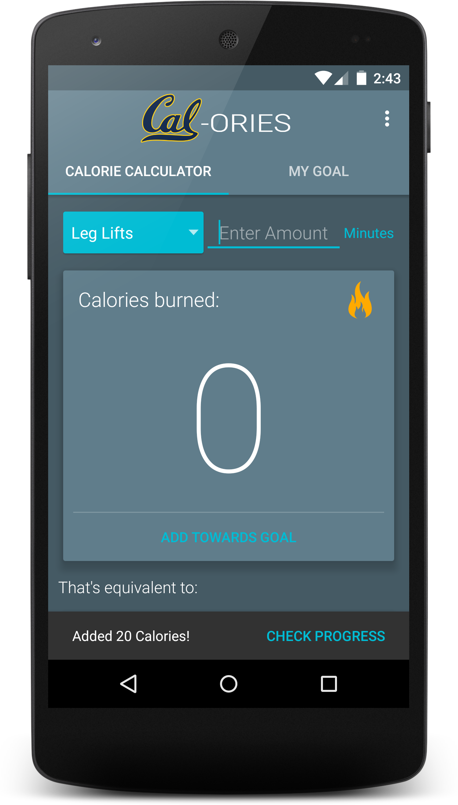

# CAL-ories

A simple and light-weight fitness tracking app focused on the user. To be more specific, the app keeps track of the calories burned per workout and lets the user set goals and work towards them. To make it easy for the user, the app calculates the workout into calories burned based on standard amounts.

## Authors

Gus Silva ([gus7silva@berkeley.edu](mailto:gus7silva@berkeley.edu))

## Demo Video

See [your demo video title here] (https://link_to_your_video)

## Screenshots

  

    
     
    The user can input the type and amount of excercise,   then instantly see the amount of calories converted. 
  
    
  
  

    
     
    They can scroll down to see a nice visualization of   excercises that will burn the same amount of calories. 
  
   
  
  

    
     
    Once the user presses 'Add Towards Goal' they are shown a unintrusive   snackbar at the bottom of the screen, letting them know their  
    workout has been added to their progress. They can click  on check progress to be taken to the screen that shows their progress  or they can simply swipe over.  
  
   
  
  

    
     
    This screen shows their progress directly through text and   visually with an animated circle. On this screen users can also  
    set a new goal or reset their progress.  
  
   
  
  

    
     
    Once a user reaches their goal, they are greeted with an encouraging message.  
  

## Acknowledgments

* afollestad: Material Dialogs
* bmarrdev: DecoView
